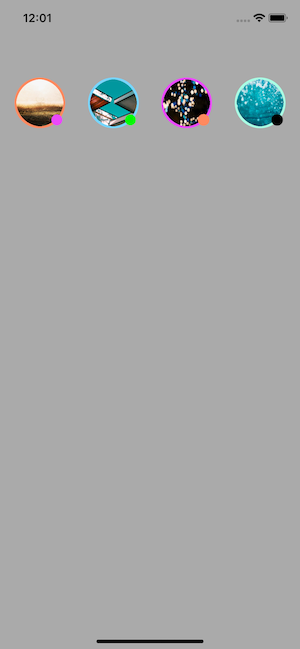

# Instagram-Stories
Reusable Component for UIView 

For use of this Component all u have to Do is download Files from given url and follow the steps as below.

1. Place StoryView.swift File inside your Project Structure.
1. Take one UIview component in your storyboard.
2. Make it's class as StoryView.
3. Now, Your component is ready.
4. U can customise your component by using it's property on attribute panel on the right side.
5. U can change background colour of ring ,also u can change size and colour of badge.

